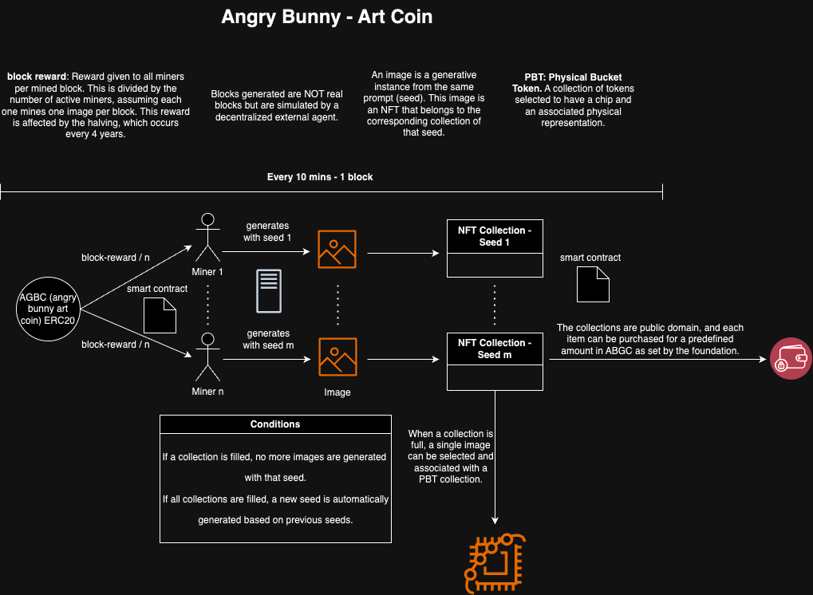

# Angry Bunny (ANGRY) - ERC20 & ERC721 Cryptocurrency

## Overview

**Angry Bunny (ANGRY)** is a pioneering cryptocurrency that combines the ERC20 and ERC721 protocols to address the challenges of massive new artistic capabilities enabled by generative AI. The project integrates Python-based server solutions to create a value-backed currency through dynamic NFT collections. Each collection is generated based on unique seed prompts, with the ability to create physical artworks embedded with Physical Backed Tokens (PBTs). 

ANGRY is not just a cryptocurrency; it is a solution to the evolving landscape of generative art. It provides a platform where AI-generated art can be minted, curated, and transformed into physical pieces, all while being integrated into the blockchain. The project aims to make these new forms of art accessible and public, allowing anyone to participate in the creation and ownership of generative art.

## Key Features

- **Dual Protocols**: Utilizes the ERC20 protocol for the ANGRY cryptocurrency and the ERC721 protocol for managing the dynamic NFT collections.
- **Generative Art NFTs**: NFTs are generated based on unique seed variations, creating diverse collections of digital art that evolve as new seeds are introduced.
- **Physical Backed Tokens (PBTs)**: Completed collections allow users to select an NFT to be realized as a physical artwork, complete with a PBT chip that links it to the blockchain.
- **Community-Curated Collections**: The community collaborates in curating the final collections, blending both digital and physical art forms.
- **Public Value Generation**: All generated value is public domain unless a specific NFT is acquired by a wallet.
- **Python Server Integration**: Python servers are employed to manage the generation, minting, and tracking of both NFTs and PBTs.

## Project Structure

```
angry-bunny-art-coin/
│
├── contracts/
│   ├── ANGRY.sol              # ERC20 Smart Contract for Angry Bunny
│   ├── NFTCollection.sol     # Base Smart Contract for NFT Collection Management
│   ├── INFTCollection.sol    # Interface for interaction with NFT Smart Contract
│   ├── PBT.sol               # Smart Contract for Physical Backed Tokens
│   └── README.md             # Documentation for Smart Contracts
│
├── server/
│   ├── api/
│   │   ├── minting.py        # API endpoint for minting new NFTs
│   │   ├── generation.py     # Logic for generating art based on seeds
│   │   ├── selection.py      # Endpoint for selecting and printing physical art
│   │   └── README.md         # Documentation for API endpoints
│   ├── config/
│   │   ├── settings.py       # Configuration settings for the server
│   │   └── README.md         # Documentation for configuration
│   ├── database/
│   │   ├── models.py         # Database models for storing metadata
│   │   └── README.md         # Documentation for database models
│   └── README.md             # Documentation for server setup and usage
│
├── tests/
│   ├── contract_tests/
│   │   ├── test_ANGRY.js      # Unit tests for the ANGRY smart contract
│   │   ├── test_NFT.sol      # Unit tests for the NFT Collection contract
│   │   └── README.md         # Documentation for contract tests
│   ├── server_tests/
│   │   ├── test_api.py       # Unit tests for server API endpoints
│   │   └── README.md         # Documentation for server tests
│   └── README.md             # Documentation for testing 
│
├── assets/
│   ├── icon.png              # Icon for Angry Bunny
│   └── diagram.png           # Project Diagram
│
├── README.md                 # Main project documentation
├── LICENSE                   # Project license
└── .gitignore                # Git ignore file
```

## How It Works

1. **Mining Process**: Miners generate new images based on unique seeds. Each seed corresponds to a prompt used for creating generative art.
2. **NFT Collection**: Generated images are minted as NFTs and added to their respective collections. When a collection is full, no more images can be generated for that seed.
3. **New Seed Generation**: Once all existing collections are complete, a new collection is dynamically created using a seed generated from the previous seeds, allowing continuous evolution of the art.
4. **PBT Selection**: When a collection is complete, users can select one image to be printed as a physical artwork, embedded with a PBT chip linking it to the blockchain.
5. **Community Curation**: The community curates which artworks are selected for physical representation, ensuring a collaborative and decentralized decision-making process.

## Public Value and Ownership

All NFTs and the value they generate are part of the public domain, making them accessible to everyone unless an NFT is acquired by a specific wallet. This ensures transparency and inclusivity while maintaining the potential for individual ownership within the ecosystem.

## Getting Started

To start using the Angry Bunny system, please refer to the [README.md](server/README.md) file in the `server/` directory for detailed instructions on setting up the Python server and deploying the smart contracts.

## Contributing

Contributions are welcome! Please see the `CONTRIBUTING.md` file for guidelines on how to contribute to the project.

## License

This project is licensed under the MIT License - see the `LICENSE` file for details.

## Art Coin Diagram



## Amoy Test Network (mumbai) Contract Addresses

Owner Address - 0xaA3d860d0390948dA38f8a3cbd3f6eF543848aC9

| Contract           | Address                                | Transaction Hash                        |
|--------------------|----------------------------------------|-----------------------------------------|
| ANGRY    | 0x1a27b49DECe68b3E31f5C72dD59DcFEd99ea874c | 0xd293d381a55f2f62f441d512ad19ffabd0542a94a8eecc249d5f0728c6978396 |
| PatreonManager   | 0x7182c98706b01ba52c2C2c32CcedE3239c70233c | 0xf034f2d557ec9d53f070b1ed09b5638d5af40be723603841e56bcd7ce46677fc |
| AreaCollectionManager    | 0x0EA06d9Fd5E95cFAc6697D3dBF0Fea0AC73CC0eF | 0x2704f6b7b7b1dcb7a2c5f6cfc29c022cd5343302903ed20ce93d955569806c01 |
| ArtWorkPoolManager    | 0xA0EE2Df96A991B345708851F7ecCCF0EA33b574c | 0xbf7cad621d4d8202c86ae5f96710f9b9d0b387c13396717579927b4b800f84bf |
